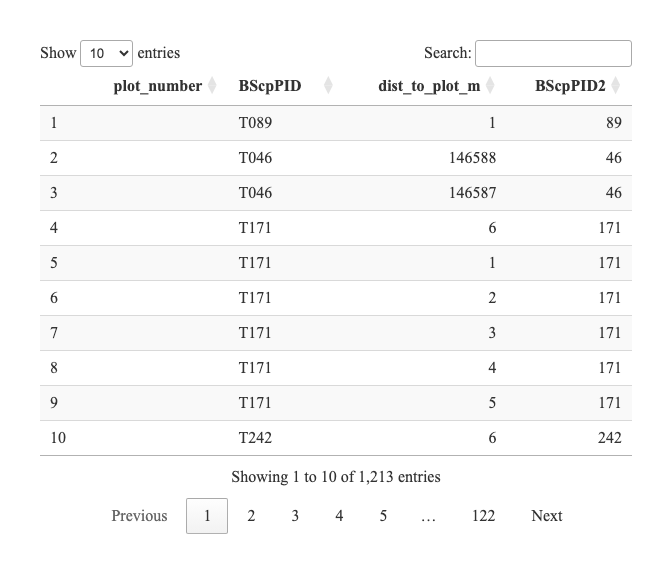

# BioSCape Photo Processing


# Process combined photo spreadsheet

## Download current version of spreadsheet

## Get sheet names

### Explore spatial data intersection

# Plot identification issues

The following table shows plots that were labeled differently in the
photo data compared to the spatial data. This could be due to a
mislabeling in the photo data or a mislabeling in the spatial data.



## Upload photo dataset to github release

## Rename and organize all photos

``` r
photo_all3 <- photo_all2 |>
  mutate(
    newfile=paste0(BScpPID,"/",BScpPID,"_",photo_type,"_",format(datetime,"%Y%m%d_%H%M%S"),".jpeg"),
    thumbfile=paste0(BScpPID,"/",BScpPID,"_",photo_type,"_",format(datetime,"%Y%m%d_%H%M%S"),"_thumb.jpeg")
    )

output_folder="data/photo_out/"

# Define the standard size (e.g., 800x600 pixels)
standard_width <- 800
standard_height <- 800

foreach(i=1:nrow(photo_all3)) %do% {
 input_file= file.path("/Users/adamw/Library/CloudStorage/GoogleDrive-adammichaelwilson@gmail.com/Shared drives",photo_all3$folder[i],photo_all3$filename[i])
 output_file=file.path(output_folder,photo_all3$newfile[i])
 output_thumb=file.path(output_folder,photo_all3$thumbfile[i])
 
 if(!dir.exists(dirname(output_file))) dir.create(dirname(output_file),recursive = T)
 
 img <- image_read(input_file)
# Resize the image to the standard size
 thumb <- image_resize(img, paste0(standard_width, "x", standard_height))
  
    # Save the image as .jpeg
  image_write(img, output_file, format = "jpeg")
  image_write(thumb, output_thumb, format = "jpeg")
  
  # update exif information in the new files

    cmd <- list(
    paste0("-overwrite_original -Description='original_path=", photo_all3$folder[i],"/",photo_all3$filename[i],
           " description=",photo_all3$description[i],
           " botanist=",photo_all3$botanist[i],"'"),    # original Description
    paste0("-Subject='", photo_all3$genus[i]," ",photo_all3$species[i],"'"),            # Genus Species
    paste0("-Title='BioSCape ", photo_all3$photo_type[i]," photo from plot ",photo_all3$BScpPID[i],"'"),             # photo type
    paste0("-Keywords='BioSCape,",photo_all3$botanist[i],"'")     # Original filename
  )
  
  # Update metadata in both output images
  exiftool_call(args = cmd,fnames=output_file)
  exiftool_call(args = cmd,fnames=output_thumb)
  
  #remove the automatic copies
}
```

# Upload Photos to Github Release

| folder | filename | description | location | plot_number | genus | species | plot_photo | inat_photo | rarefaction_photo | rarefaction_replicate | gps_latitude | gps_longitude | gps_altitude | gps_position_error | modify_date | date | time | offset_time | image_width | image_height | gps_datestamp | file_type | media_group_uuid | file_base | botanist | id | file_url | geometry | datetime | photo_type |
|:---|:---|:---|:---|:---|:---|:---|---:|:---|---:|---:|---:|---:|---:|---:|:---|:---|---:|:---|---:|---:|:---|:---|:---|:---|:---|:---|:---|:---|:---|:---|
| BioSCape_Admin/VegPlots/Photos/BioSCape1_Ross//Photos from 2023 | IMG_0006.HEIC | NA | NA | NA | NA | NA | NA | NA | NA | NA | -34.08549 | 18.42051 | 320.18445 | 4.750614 | 2023-03-27 13:55:32 | 2023-03-27 | 13H 55M 32S | =+02:00 | 4032 | 3024 | 2023:03:27 13:55:32 | HEIC | NA | IMG_0006 | Ross | NA | NA | POINT (18.42051 -34.08549) | 2023-03-27 13:55:32 | species |
| BioSCape_Admin/VegPlots/Photos/BioSCape1_Ross//Photos from 2023 | IMG_0014.HEIC | NA | NA | NA | NA | NA | NA | NA | NA | NA | -34.19239 | 24.83940 | 21.59512 | 4.581170 | 2023-04-19 14:19:37 | 2023-04-19 | 14H 19M 37S | =+02:00 | 4032 | 3024 | 2023:04:19 14:19:37 | HEIC | NA | IMG_0014 | Ross | NA | NA | POINT (24.8394 -34.19239) | 2023-04-19 14:19:37 | species |
| BioSCape_Admin/VegPlots/Photos/BioSCape1_Ross(1)//Takeout 2/Takeout 19/Google Photos/Photos from 2023 | IMG_0015.HEIC | NA | NA | NA | NA | NA | NA | NA | NA | NA | -34.19237 | 24.83940 | 22.49422 | 4.755119 | 2023-04-19 14:20:38 | 2023-04-19 | 14H 20M 38S | =+02:00 | 4032 | 3024 | 2023:04:19 14:20:38 | HEIC | NA | IMG_0015 | Ross | NA | NA | POINT (24.8394 -34.19237) | 2023-04-19 14:20:38 | species |
| BioSCape_Admin/VegPlots/Photos/BioSCape1_Ross//Photos from 2023 | IMG_0016.HEIC | Romulea rosea with Stachys aetiopica | Romulea rosea with Stachys aetiopica | NA | NA | NA | NA | NA | NA | NA | -34.19236 | 24.83940 | 22.38942 | 4.773801 | 2023-04-19 14:20:57 | 2023-04-19 | 14H 20M 57S | =+02:00 | 4032 | 3024 | 2023:04:19 14:20:57 | HEIC | NA | IMG_0016 | Ross | NA | NA | POINT (24.8394 -34.19236) | 2023-04-19 14:20:57 | species |
| BioSCape_Admin/VegPlots/Photos/BioSCape1_Ross//Photos from 2023 | IMG_0017.HEIC | Cederberg.171.South.view | Cederberg | 171.0 | South | view | 1 | NA | NA | NA | -32.15117 | 19.02682 | 895.22056 | 4.728455 | 2023-05-03 09:37:15 | 2023-05-03 | 9H 37M 15S | =+02:00 | 3024 | 4032 | 2023:05:03 09:37:15 | HEIC | NA | IMG_0017 | Ross | NA | NA | POINT (19.02682 -32.15117) | 2023-05-03 09:37:15 | plot |
| BioSCape_Admin/VegPlots/Photos/BioSCape1_Ross//Photos from 2023 | IMG_0018.HEIC | Cederberg.171.South.view.2 | Cederberg | 171.0 | South | view.2 | 1 | NA | NA | NA | -32.15117 | 19.02682 | 893.64451 | 4.726790 | 2023-05-03 09:37:40 | 2023-05-03 | 9H 37M 40S | =+02:00 | 4032 | 3024 | 2023:05:03 09:37:40 | HEIC | NA | IMG_0018 | Ross | NA | NA | POINT (19.02682 -32.15117) | 2023-05-03 09:37:40 | plot |
